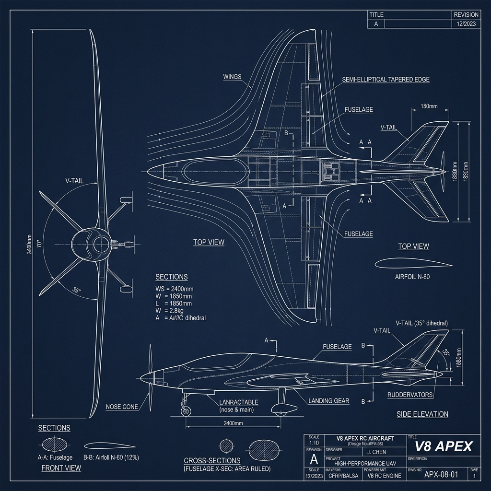
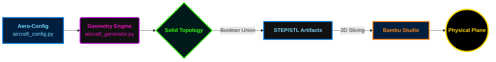
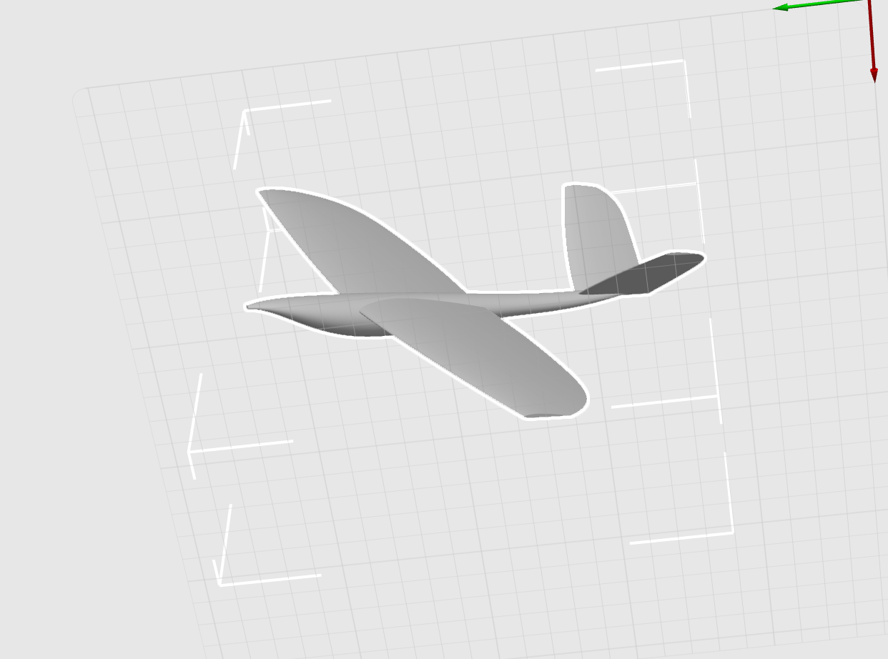
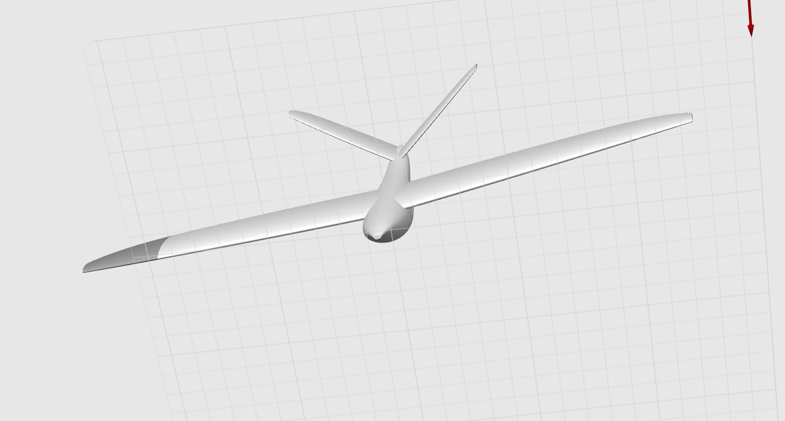

<div align="center">
  
</div>

# 🌊 APEX V8.2: Aerodynamic Liquid
### Apex: Parametric Aero-Modeling Toolbox

> **"仅需一句话，即可生成航模 3D 外观，节省 80% 的设计时间。"**

[](https://github.com/George3215/3D_Print_Plane_Auto_Design/blob/main/assets/v8_apex_web_preview.stl)

*极致平滑的多截面曲面插值，专为追求气动完美的 3D 打印航模玩家设计。*

</div>

---

## 🛠️ 设计流程 (Design Pipeline)



## ✨ V8.2 深度平滑升级 (Smoothing Update)

在 V8.2 版本中，我们执行了全面的“线条去棱角化”工程，将模型从“工程原型”推向了“液态曲面”的美学高度：

- 🚀 **12 段高频截面放样 (2x Density)**：机翼和平尾的建模插值频率增加一倍。通过高阶样条计算，消除了以往版本中可能存在的微小转折棱角，实现了完美的半椭圆弧线过渡。
- 💧 **面律过渡修圆 (Coke-Bottle Refinement)**：重新分配了机身面积律 (Area Rule) 的控制点权重。机头、座舱与机翼根部的交汇处现在如同流动的水滴一般自然，极大优化了表面反射与气流连贯性。
- 🧬 **极致流线参数化**：在 `aircraft_config.py` 中引入了更精细的后掠指数（Power Law Sweep），使机翼的弧向美感更加符合专业级滑翔机标准。

---

## 🕹️ 交互式 3D 窗口 (Main Page Interaction)

> **[重要提示]**：为了在 GitHub 主页获得最佳 3D 预览体验，请通过顶部的 **[🕹️ ENTER 3D VIEWER]** 动态徽章按钮，或直接点击下方链接：

### **👉 [点击此处：在 GitHub 官方 3D 引擎中旋转查看模型]**
(https://github.com/George3215/3D_Print_Plane_Auto_Design/blob/main/assets/v8_apex_web_preview.stl)

---

## ⚒️ 技术规格 (Technical Specs)

| 参数项 | V8.2 优化值 | 描述 |
| :--- | :--- | :--- |
| **放样段数** | 12 Sections | 确保表面极度顺滑 |
| **翼型采样** | N_PTS=25 | 精确还原 NACA 2409 高速翼型 |
| **表面状态** | Manifold Solid | 针对拓竹 Surface Mode 极致优化 |
| **导出格式** | STEP / Web-STL | 兼顾工程精度与网页分发 |

---

## 🚀 开发者快速启动

```bash
# 修改配置，定义你的专属曲线
vim aircraft_config.py

# 一键生成 V8.2 极致平滑模型
python aircraft_generator.py
```

---

## 🎨 设计图廊 (Design Gallery)

> 以下是 Apex V8.2 项目的设计手稿与核心视角展示：

<div align="center">
<table border="0">
  <tr>
    <td align="center">
      
      <br><b>细节视图 A (Detail View A)</b>
    </td>
    <td align="center">
      
      <br><b>细节视图 B (Detail View B)</b>
    </td>
  </tr>
</table>
</div>

---

> *"致力于将每一微米的阻力化为无形。"*
